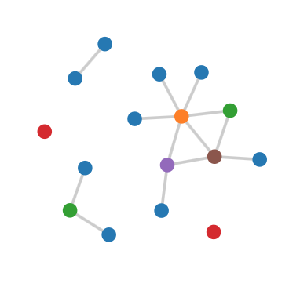
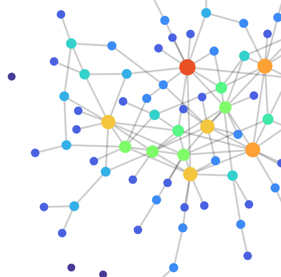
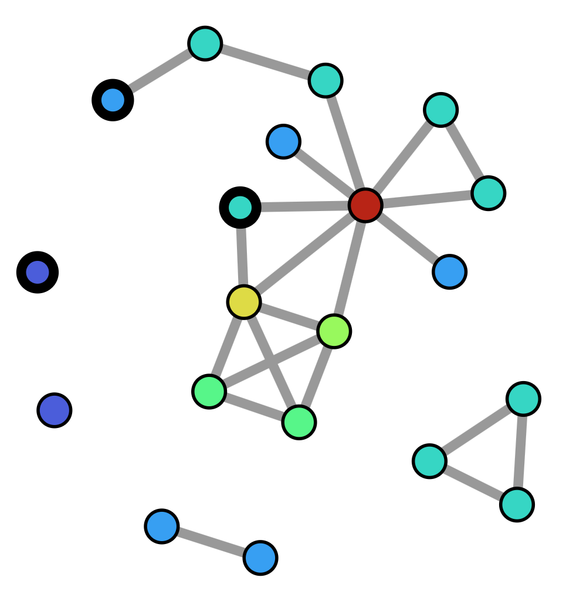
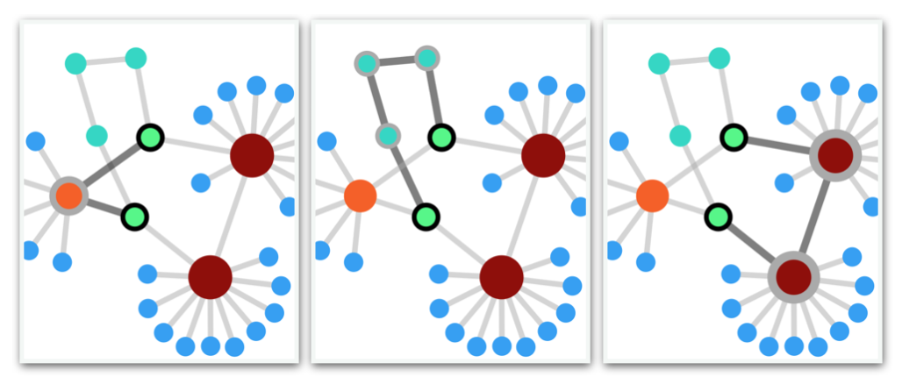

# D3JSdemo

 **D3.js Editor with Scale-Free graph generation**

* Live hosting at [thiebaux.site44.com](https://thiebaux.site44.com/D3JSdemo/demo.html)



## Scale-Free Graphs

If you are going to practice tree and graph algorithms for traversal and feature detection, you will want tools to view and validate the results, and also a way to generate a variety of interesting graphs to test on. This project addresses both of these goals.

Scale-free networks are so called because they exhibit characteristics in common with natural networks of all sizes found in the real world. In particular, the *degree distribution* of edge counts among nodes follows a *power-law*, with most nodes having only a few edges (the boonies) and a few nodes having many (the hubs), regardless of scale.

In order to algorithmically generate an endless variety of such graphs for testing and simulation, they are typically *grown* from scratch using a set of rules from which their desired characteristics emerge. This is the subject of much theoretical analysis in the network literature. While a graph may seem like a rather simple construct, it can contain vast structural complexity.

The graph shown here is grown using the *Configuration Model*, which applies a prescribed power-law degree distribution to a set of nodes, assigning to each one a number of unmatched edge stubs. These stubs are then randomly assigned to each other using a pair matching algorithm. Care must be taken to avoid introducing biases that could invalidate the desired properties.



## D3 Web Visualization

Using D3.js open source visualization tools, the graphs are displayed interactively within the web page. Each restart generates a new graph with the same properties. Each node can be touched and dragged around, rearranging the spatial configuration using force calculations (global gravitation and local repulsion). By "massaging" the layout, one can coerce it to relax, exposing hidden structure. The slider controls the random mutation rate, and the graph evolves.


## Learning Curve

Knowing almost nothing about *SVG* tags and D3 visualization development, I set out examining a dozen or more code examples demonstrating a variety of functionality, as well as cryptic and outdated tutorials. I then migrated those codes from their v3 and v4 syntax into the latest v7, which is not backward compatible. A problem for reverse engineering.

Finally, I stress test the resulting code with a scalable, high performance set of operations, of some interest to graph theorists. A histogram of cumulative mutations shows consistent power law distribution of node degree, while sensitive to initial conditions. Style transition chains are seductive, and troublesome when large graphs are edited.

While testing degenerate cases, I found a rare error message streaming from the D3 force engine, dealing with numeric precision handling in the Safari browser. When you are down to two nodes and delete one of them, after ten seconds the position coordinates of the remaining node fall under 1.0e-100, which can't be mapped to a raw number from a numeric string for the internal SVG element. This can go unnoticed because *undefined* resolves to zero. This is patched with the following boilerplate sim initialization:

```
d3.forceSimulation()
  .on( "tick",
    () => {
      nodes.attr( "cx", d.x.toFixed( 100 ) )
    }
  );
```



## Graph Editor

* Live hosting at [thiebaux.site44.com](https://thiebaux.site44.com/D3JSdemo/index.html)

Building on lessons learned from implementing link mutations, the project developed into a general graph editor, allowing insertion and deletion of both links and nodes, with a variety of initialization options. With deep refactoring and modularization of the various components, it becomes easier to customize the client code for specific purposes, such as animated graph traversal and feature detection.

Each node maintains a separate list of its neighbors (adjacency array), for ease of traversal. When a node is deleted, there is some redundant book-keeping. We require a separate list of links curated for the D3 visualizer. To support deletion, each node must be referred to by unique name, rather than its position in the array. These are kept in a hash map. The degree vector is used to color nodes and update the histogram.

A very simple graph has the following properties at minumum, with the map initialized to identity values:

```
graph: {
    map: [ [0,0], [1,1], [2,2], [3,3] ],
    nodes: [
        { id: 0, adjacent: [ 1 ] },
        { id: 1, adjacent: [ 0, 2 ] },
        { id: 2, adjacent: [ 1 ] },
        { id: 3, adjacent: [] }
    ],
    links: [
        { source: 0, target: 1 },
        { source: 1, target: 2 }
    ]
}
```

While the link source and target are conveniently referenced by node id on initialization, as soon as the graph is fed to the simulation, these are automatically expanded by D3 into their corresponding object instances. This means that while typeof *source* starts out as 'number', it will eventually become type 'object'. For consistency, the editing app expands them immediately on creation and while editing.

Manual editing operations are supported with 3 custom action buttons: *links*, *add*, and *del*. These are sufficient to allow intuitive modification and building of unique graphs.

* **links**: For each selected node, select its links and then unselect the node. This logic allows all elements to be unselected by clicking twice.

* **add**: If no nodes are selected, a new unconnected node is added. If one node is selected, a new node is added and linked to it. When multiple nodes are selected, they are linked together in order of selection.

* **del**: Remove all selected links and nodes from the graph.




## Weighted Path Search

If at least 2 nodes are selected, the first and last serve as end points for a path search algorithm. If the *auto* checkbox is checked, the program will continuously search for the path between these nodes while the graph is actively mutating.

* **BFS**: Standard breadth first search
* **DJK**: Dijkstra's with uniform edge weights
* **Dmin**: Weighted for dense hub avoidance
* **Dmax**: Inverted weights for dense hub preference

For Dijkstra's weighted path algorithm, weights are automatically generated based on node degrees of each link's endpoints. The degrees are combined based on the product of the square-roots of each node's degree, resulting in hub avoidance. The result is inverted to find paths that prefer hubs.


