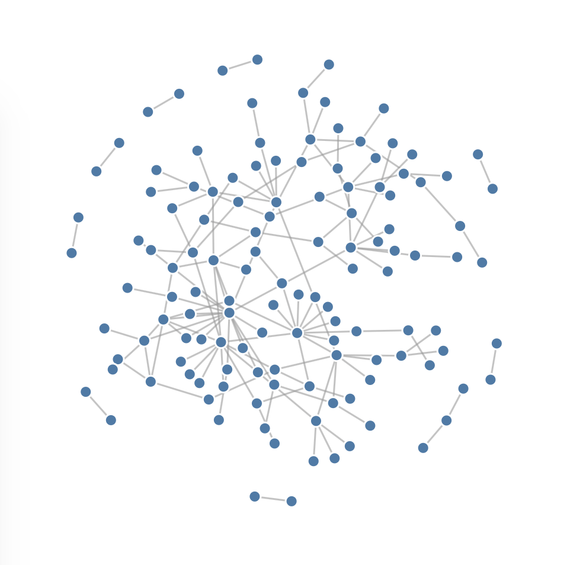

# D3JSdemo

 **D3.js Demo with scale-free graph generation**

* Live hosting at [thiebaux.site44.com](https://thiebaux.site44.com/D3JSdemo/index.html)

### Scale-Free Graphs

If you are going to practice tree and graph algorithms for traversal and feature detection, you will not only want tools to view the results, but also a way to generate a variety of interesting graphs to test on.

Scale-free networks are so called because they exhibit characteristics in common with natural networks found in the real world. In particular, the *degree distribution*, or distribution of edge counts among nodes, follows a *power law*, with most nodes having only a few edges (the boonies) and a few nodes having many (the hubs), regardless of size.

In order to algorithmically generate an endless variety of such graphs for testing and simulation, they are typically *grown* from scratch using a set of rules from which their desired characteristics emerge. This is the subject of much theoretical analysis in the network literature. While a graph may seem like a rather simple construct, it can contain enormous structural complexity.

The graph shown here is grown using the *Configuration Model*, which applies a prescribed degree distribution to a set of nodes, assigning to each one a number of unmatched edge stubs. These stubs are then randomly assigned to each other using a pair matching algorithm. Care must be taken to avoid introducing biases that could invalidate the desired properties.

Using D3.js open source visualization tools, the resulting graph is displayed interactively within the web page. Each page refresh generates a new graph with the same properties. Each node can be touched and dragged around, rearranging the spatial configuration using force calculations (global gravitation and local repulsion). By "massaging" the layout, you can coerce it to relax and spread out, highlighting hidden structure.
