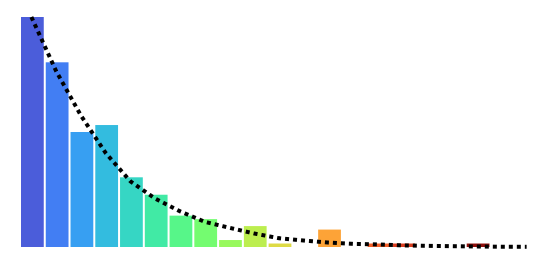

# D3JSdemo

 **D3.js Editor with Scale-Free graph generation**

* Live hosting at [thiebaux.site44.com](https://thiebaux.site44.com/D3JSdemo/index.html)


## Scale-Free Graphs

If you are going to practice tree and graph algorithms for traversal and feature detection, you will want tools to view and validate the results, and also a way to generate a variety of interesting graphs to test on. This project addresses both of these goals.

Scale-free networks are so called because they exhibit characteristics in common with natural networks of all sizes found in the real world. In particular, the *degree distribution* of edge counts among nodes follows a *power-law*, with most nodes having only a few edges (the boonies) and a few nodes having many (the hubs), regardless of scale.

In order to algorithmically generate an endless variety of such graphs for testing and simulation, they are typically *grown* from scratch using a set of rules from which their desired characteristics emerge. This is the subject of much theoretical analysis in the network literature. While a graph may seem like a rather simple construct, it can contain vast structural complexity.

The graph shown here is grown using the *Configuration Model*, which applies a prescribed power-law degree distribution to a set of nodes, assigning to each one a number of unmatched edge stubs. These stubs are then randomly assigned to each other using a pair matching algorithm. Care must be taken to avoid introducing biases that could invalidate the desired properties.


## D3 Web Visualization

Using D3.js open source visualization tools, the graphs are displayed interactively within the web page. Each restart generates a new graph with the same properties. Each node can be touched and dragged around, rearranging the spatial configuration using force calculations (global gravitation and local repulsion). By "massaging" the layout, one can coerce it to relax, exposing hidden structure. The slider controls the random mutation rate, and the graph evolves.



## Learning Curve

Knowing almost nothing about *SVG* tags and D3 visualization development, I set out examining a dozen or more code examples demonstrating a variety of functionality, as well as cryptic and outdated tutorials. I then migrated those codes from their v3 and v4 syntax into the latest v7, which is not backward compatible. A problem for reverse engineering.

Finally, I stress test the resulting code with a scalable, high performance set of operations, of some interest to graph theorists. A histogram of cumulative mutations shows consistent power law distribution of node degree, while sensitive to initial conditions. Style transition chains are seductive, and troublesome when large graphs are edited.

While testing degenerate cases, I found a rare error message streaming from the D3 force engine, dealing with numeric precision handling in the Safari browser. When you are down to two nodes and delete one of them, after ten seconds the position coordinates of the remaining node fall under 1.0e-100, which can't be mapped to a raw number from a numeric string for the internal SVG element. This can go unnoticed because *undefined* resolves to zero. This is fixed with the following patch to boilerplate sim initialization:

```
d3.forceSimulation()
    .on( "tick", () => {
        nodes.attr( "cx", d.x.toFixed( 100 ) )
    }
);
```


## Graph Editor

* Live hosting at [thiebaux.site44.com](https://thiebaux.site44.com/D3JSdemo/editor.html)


...
Each node maintains a separate list of its neighbors (adjacency array), for ease of traversal. When a node is deleted, there is a lot of book-keeping to keep straight. We can’t just use the simplest graph representation typically used for a search task. We also need maintain a separate edge list curated for the D3 visualizer. To support deletion, each node must be referred to by unique name, rather than its position in the array. These are kept in a hash map.


